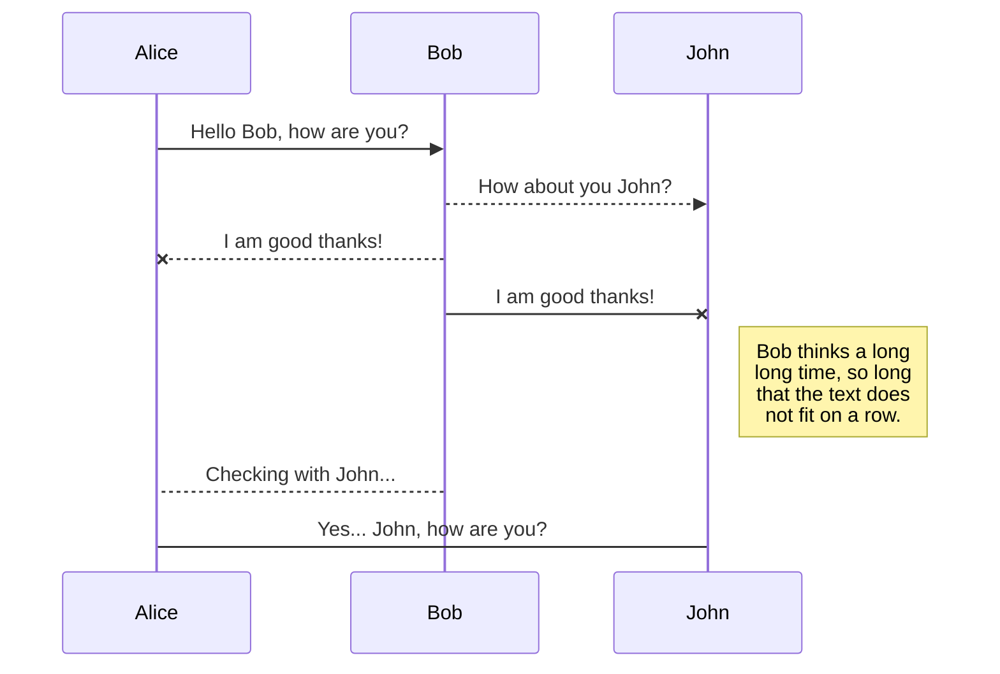
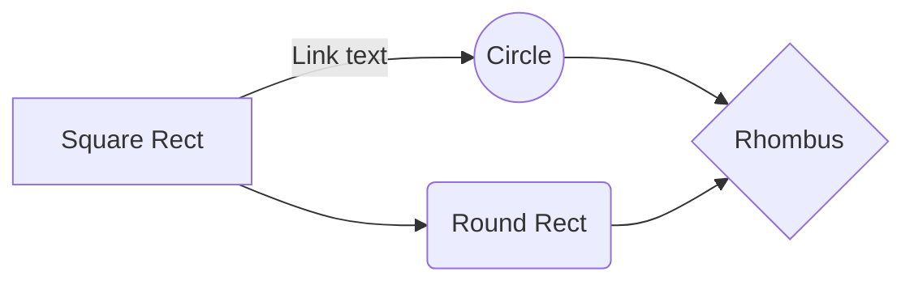

### Colin Harfst Submission

#### To run this project:

- Run `dotnet run --project YankeesChallenge` from the root directory.
- Open https://localhost:5001/swagger/index.html.
- Include React info here.

#### Notes:

> Use this space to include some extra info.

- Is .NET Web API really the way to go here when I could use .NET MVC?
- Include some unit test info.
- What are some things I may have done differently if I had loads of extra time?

### This is a chart (may want to use this for something):

|                | Endpoint           | Example            |
| -------------- | ------------------ | ------------------ |
| `/Player/{id}` | `GET /Player/{id}` | `/Player/12345678` |
| `/Team/{id}`   | `GET /Team/{id}`   | `/Team/Yankees`    |

### This is a diagram (probably won't want to use this for anything):

You can render UML diagrams using [Mermaid](https://mermaidjs.github.io/). For example, this will produce a sequence diagram:

And this will produce a flow chart:

